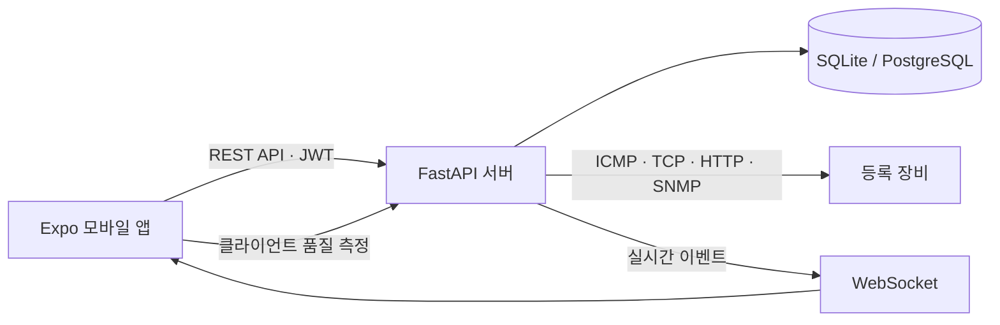

<div align="center">

# NetScope

### 네트워크 상태를 측정하고, 장애 원인을 추적하는 모바일 모니터링 도구

등록한 장비의 상태와 품질 지표를 주기적으로 수집하고<br>
이벤트 감지부터 인시던트 대응, Wi-Fi 환경 비교까지 하나의 흐름으로 관리합니다.


</div>

---

## 프로젝트 소개

NetScope는 **Expo 기반 모바일 앱**과 **FastAPI 백엔드**로 구성된 네트워크 모니터링 프로젝트입니다. 서버가 등록 장비를 30초 간격으로 확인하고, 측정 결과를 저장해 대시보드와 시계열 차트로 보여줍니다.

상태 변화나 품질 저하가 감지되면 이벤트와 인시던트를 생성하며, 모바일 앱에서는 담당자 지정·확인·메모·해결까지 대응 이력을 관리할 수 있습니다. 사용 중인 모바일 기기 자체의 네트워크 품질을 진단하거나, 여러 Wi-Fi 공유기 배치를 같은 위치 기준으로 비교하는 기능도 제공합니다.

## 주요 기능

| 영역 | 구현 내용 |
| --- | --- |
| 장비 모니터링 | IP 기반 장비 등록, 수정, 삭제 및 모니터링 활성화 설정 |
| 상태 측정 | ICMP 도달 여부, 평균 지연시간, 패킷 손실률, 지터 측정 |
| 자동 감지 | `Online` · `Warning` · `Offline` 분류 및 30초 주기 모니터링 |
| 이벤트 | 장애·품질 저하·복구 이벤트 생성 및 WebSocket 실시간 전달 |
| 인시던트 | 확인, 담당자 지정, 메모, 상태 변경, 해결 기록 관리 |
| 상세 진단 | DNS, 인터넷 연결, TCP 포트, HTTP/HTTPS, Traceroute 검사 |
| SNMP v2c | 시스템 정보, 업타임, CPU, 인터페이스 카운터 및 대역폭 수집 |
| 내 네트워크 진단 | 모바일 기기의 지연시간, 지터, 실패율, 다운로드 속도 측정 |
| 진단 이력 | 사용자별 측정 결과 저장, 상세 조회 및 품질 점수 확인 |
| Wi-Fi Site Survey | 배치별·위치별 측정값 저장, 점수 순위와 전후 결과 비교 |
| 운영 분석 | 최근 24시간 인시던트, 가용성, 평균 해결 시간, 주요 원인 집계 |
| 접근 제어 | JWT 로그인, 조직별 데이터 분리, Admin·Operator·Viewer 역할 구분 |

## 동작 구조



- 백엔드가 활성화된 장비를 주기적으로 진단하고 측정값을 저장합니다.
- 임계치를 벗어나면 이벤트와 인시던트를 생성합니다.
- 모바일 앱은 REST API로 데이터를 조회하고 WebSocket으로 새 이벤트를 받습니다.
- 기본 저장소는 SQLite이며, PostgreSQL 연결도 설정할 수 있습니다.

## 기술 스택

| 구분 | 기술 |
| --- | --- |
| Mobile | React Native, Expo, TypeScript, React Navigation |
| Backend | Python, FastAPI, SQLAlchemy, Pydantic |
| Database | SQLite, PostgreSQL |
| Realtime | WebSocket |
| Network | ICMP Ping, DNS, TCP, HTTP/HTTPS, Traceroute, SNMP v2c |
| Auth | JWT, bcrypt, 역할 기반 접근 제어 |
| Test | Pytest, FastAPI TestClient, TypeScript Compiler |
| Deploy | Docker, Google Cloud Build, Cloud Run, Cloud SQL, Secret Manager |

## 시작하기

### 1. 저장소 복제

```bash
git clone https://github.com/byeongik-debug/NetScope.git
cd NetScope
```

### 2. 백엔드 실행

```powershell
cd backend
python -m venv .venv
.\.venv\Scripts\Activate.ps1
pip install -r requirements.txt
uvicorn app.main:app --reload
```

백엔드는 기본적으로 `http://127.0.0.1:8000`에서 실행됩니다. 실행 후 아래 주소에서 API 문서를 확인할 수 있습니다.

- Swagger UI: `http://127.0.0.1:8000/docs`
- Health Check: `http://127.0.0.1:8000/api/v1/health`

### 3. 모바일 앱 실행

새 터미널에서 실행합니다.

```powershell
cd mobile
npm install
npm start
```

에뮬레이터가 아닌 실제 기기에서 접속할 때는 앱의 **설정**에서 서버 주소를 백엔드가 실행 중인 PC의 LAN IP로 변경해야 합니다.

```text
예시: http://192.168.0.10:8000
```

### 기본 로그인

```text
Email: admin@netscope.local
Password: admin
```

> 기본 계정은 로컬 실행과 확인을 위한 값입니다. 외부에 배포할 때는 비밀번호와 `NETSCOPE_SECRET_KEY`를 반드시 변경하세요.

## 환경 설정

백엔드는 `NETSCOPE_` 접두사가 붙은 환경 변수를 사용하며, `backend/.env`에서도 값을 읽습니다.

```env
NETSCOPE_DATABASE_URL=sqlite:///./netscope.db
NETSCOPE_SECRET_KEY=replace-with-a-strong-secret
NETSCOPE_ACCESS_TOKEN_MINUTES=720
NETSCOPE_CORS_ORIGINS=["*"]
```

| 환경 변수 | 기본값 | 설명 |
| --- | --- | --- |
| `NETSCOPE_DATABASE_URL` | `sqlite:///./netscope.db` | SQLAlchemy 데이터베이스 연결 주소 |
| `NETSCOPE_SECRET_KEY` | 개발용 기본 키 | JWT 서명 및 SNMP Community 암호화에 사용 |
| `NETSCOPE_ACCESS_TOKEN_MINUTES` | `720` | 액세스 토큰 유효 시간(분) |
| `NETSCOPE_CORS_ORIGINS` | `["*"]` | 허용할 CORS Origin 목록 |

## 진단 기준

장비 상태는 실제 Ping 측정 결과를 기준으로 분류합니다.

| 상태 | 기준 |
| --- | --- |
| `Online` | 응답 가능, 패킷 손실 20% 미만, 지연시간 200ms 미만 |
| `Warning` | 패킷 손실 20% 이상 또는 지연시간 200ms 이상 |
| `Offline` | Ping 응답 없음 |

상태 변화와 임계치 초과는 이벤트로 기록되며, `Critical`·`High`·`Medium` 이벤트는 열린 인시던트가 없을 때 인시던트도 함께 생성합니다.

## SNMP v2c 설정

장비 상세 화면에서 SNMP를 활성화하고 읽기 전용 Community와 UDP 포트를 입력할 수 있습니다. 연결 테스트 후 저장하면 다음 모니터링 주기부터 수집을 시도합니다.

- 시스템 이름과 설명
- 업타임
- Host Resources CPU 값(장비 지원 시)
- 64-bit 인터페이스 Octet Counter
- Counter 변화량을 이용한 대역폭

대역폭은 이전 Counter와의 차이로 계산하므로 **두 번 이상의 정상 수집**이 필요합니다. SNMP Community는 암호화해 저장하며 REST API 응답에는 포함하지 않습니다.

## 테스트

프로젝트 루트에서 백엔드 테스트와 모바일 타입 검사를 함께 실행할 수 있습니다.

```powershell
npm test
```

개별 실행도 가능합니다.

```powershell
python -m pytest backend/tests
npm run mobile:check
```

## 프로젝트 구조

```text
NetScope/
├─ backend/
│  ├─ app/
│  │  ├─ api/             # 인증 및 네트워크 API
│  │  ├─ core/            # 설정, DB, 인증, 암호화
│  │  ├─ integrations/    # SNMP 연동
│  │  ├─ models/          # SQLAlchemy 모델
│  │  ├─ repositories/    # 데이터 접근 계층
│  │  ├─ services/        # 모니터링 및 진단 로직
│  │  └─ realtime/        # WebSocket 연결 관리
│  └─ tests/              # API 및 진단 테스트
├─ mobile/
│  └─ src/
│     ├─ api/             # API 클라이언트
│     ├─ components/      # 공통 UI 컴포넌트
│     ├─ context/         # 앱 전역 상태
│     ├─ navigation/      # 화면 탐색 구조
│     ├─ screens/         # 기능별 화면
│     └─ services/        # 네트워크·진단·알림 서비스
├─ docs/                  # 배포 및 포트폴리오 문서
├─ cloudbuild.yaml        # Google Cloud Build 설정
└─ package.json           # 통합 실행 스크립트
```

## 배포 참고

Cloud Run, Cloud SQL for PostgreSQL, Secret Manager를 사용하는 배포 설정이 포함되어 있습니다.

- 배포 절차: [`docs/GCP_DEPLOYMENT.md`](docs/GCP_DEPLOYMENT.md)
- 빌드 설정: [`cloudbuild.yaml`](cloudbuild.yaml)

> Cloud Run에서는 사설망의 RFC1918 주소에 직접 접근할 수 없습니다. 사내·가정 네트워크 장비를 모니터링하려면 별도의 온프레미스 수집기 또는 VPN 연결이 필요합니다.

## 현재 범위와 제약

- Ping과 SNMP 수집은 **백엔드 서버에서 대상 장비로 접근할 수 있을 때** 동작합니다.
- SNMP CPU 값은 대상 장비가 관련 Host Resources OID를 제공할 때만 수집됩니다.
- 메모리 사용량 수집은 현재 구현되어 있지 않습니다.
- Ping 전용 장비에서는 CPU·대역폭 같은 SNMP 지표가 표시되지 않습니다.
- 등록 대상은 본인이 소유하거나 모니터링 권한을 가진 시스템으로 제한해야 합니다.

---

<div align="center">
  <sub>Observe the network. Find the cause. Respond with context.</sub>
</div>
